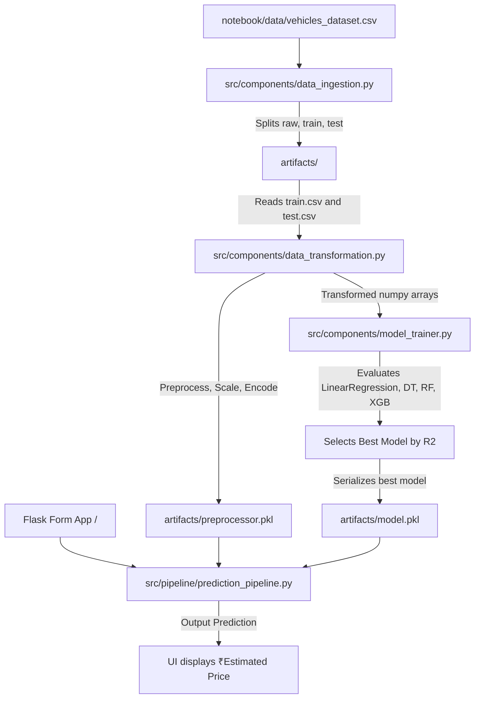

# Car Price Prediction - End-to-End MLOps Project

A robust, production-ready, end-to-end Machine Learning pipeline for predicting car prices using the `vehicles_dataset.csv`. This project is structured according to professional MLOps design patterns inspired by Krish Naik's architecture, emphasizing modularity, object-oriented design, custom exception handling, and robust logging.

---

## 🏗️ Project Architecture

The application is structured into modular components that separate concern at each stage of the lifecycle:



---

## 📁 Project Structure

```text
Model_3_DEV/
│
├── artifacts/              # Generated datasets and serialized pickle binaries (git ignored)
├── logs/                   # Log output files detailing runtime steps (git ignored)
├── notebook/               # Jupyter notebook and source data
│   ├── Car_Price_Prediction.ipynb
│   └── data/
│       └── vehicles_dataset.csv
│
├── src/                    # Modular source packages
│   ├── components/
│   │   ├── __init__.py
│   │   ├── data_ingestion.py      # Splits data and orchestrates pipeline execution
│   │   ├── data_transformation.py # Custom cleaning, simplifying, and encoding pipelines
│   │   └── model_trainer.py       # Trains regressors and selects best based on test metrics
│   │
│   ├── pipeline/
│   │   ├── __init__.py
│   │   └── prediction_pipeline.py # Accepts user inputs and runs inference
│   │
│   ├── __init__.py
│   ├── exception.py               # Custom Exception class with file and line tracebacks
│   ├── logger.py                  # Standard logging setup (log folder and file creator)
│   └── utils.py                   # Dill serializer helpers and evaluation scripts
│
├── templates/
│   └── home.html           # Glassmorphic, dark-mode user interface
│
├── app.py                  # Flask application entry point
├── requirements.txt        # PIP dependencies
├── setup.py                # Setup configuration for editable packaging installation
└── README.md               # Documentation
```

---

## 📊 Dataset Description

The project uses the `vehicles_dataset.csv` with the target variable `price`. 
Preprocessing steps from the notebook are strictly preserved:
- Null `price` rows are removed.
- `description` column is dropped.
- `mileage` is imputed with the training mean.
- `cylinders` is imputed with the training mode.
- Mode imputation is applied to all categorical columns (`engine`, `fuel`, `transmission`, `trim`, `body`, `doors`, `exterior_color`, `interior_color`).
- `transmission` values are mapped via `simplify_transmission` to `Automatic`, `Manual`, `CVT`, or `Other`.
- The final feature representation drops `'name'`, `'model'`, and `'trim'` for the best regressor model.

---

## 🛠️ Installation Steps

1. **Clone the repository:**
   ```bash
   git clone <repository-url>
   cd Model_3_DEV
   ```

2. **Create and activate a virtual environment:**
   ```bash
   python -m venv venv
   # On Windows:
   venv\Scripts\activate
   # On macOS/Linux:
   source venv/bin/activate
   ```

3. **Install the dependencies in editable mode:**
   ```bash
   pip install -r requirements.txt
   ```

---

## 🚀 Running Instructions

### 1. Train the Pipeline
To ingest data, run transformation preprocessing, train the regressors, and save the serialized models:
```bash
python src/components/data_ingestion.py
```
This will print a comparative model performance table inside your terminal and select the model with the highest test R² score.

### 2. Launch Flask Web Application
Once training is complete and artifacts are generated, run:
```bash
python app.py
```
Open `http://127.0.0.1:5000/` in your browser to interact with the model prediction portal.

---

## 🎯 Model Comparison Matrix
When the training pipeline is executed, it compares four algorithms (Linear Regression, Decision Tree, Random Forest, and XGBoost) and reports:
- **R² Score** (Coefficient of Determination)
- **Mean Absolute Error (MAE)**
- **Root Mean Squared Error (RMSE)**

The model with the highest R² score is automatically serialized to `artifacts/model.pkl`.

---

## 💡 Future Improvements
- Implement hyperparameter tuning (e.g. RandomizedSearchCV) in `model_trainer.py`.
- Introduce CI/CD integration with GitHub Actions.
- Set up a containerized deployment workflow using Docker and Kubernetes.